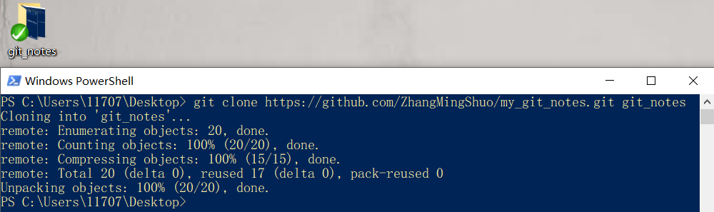
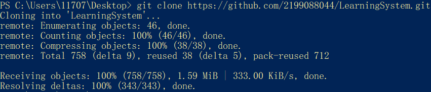
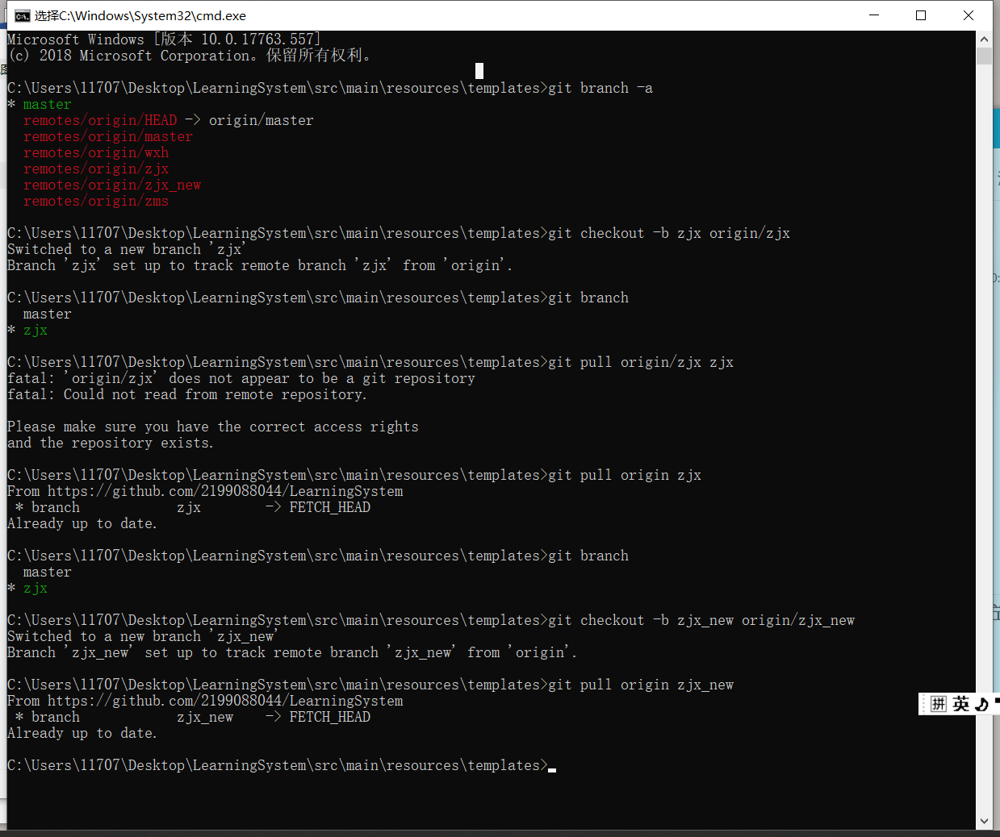

#### 1.使用命令行进行pull


#### 2.使用命令行进行push


#### 3.welcome to clone my_git_notes




#### 4.clone github一个项目的其中的一个分支到本地

step 1：




step 2：



#### 5.查看当前git用户名和个人邮箱

```bash
git config user.name
git config user.email
```

#### 6.修改当前git用户名和个人邮箱

```bash
git config --global user.name "XXX"
git config --global user.email "XXX"
git config --global user.password "XXX"
```

